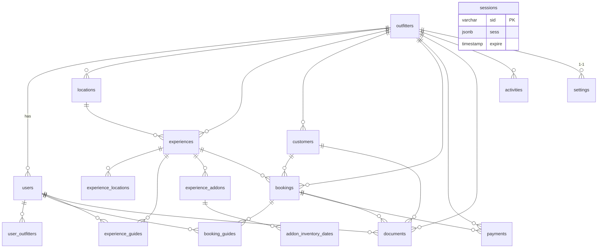

# 📊 Outfitter Database Schema

A high–level reference for developers working with the **PostgreSQL** schema defined in `shared/schema.ts` (Drizzle ORM).

---

## 1. Entity–Relationship Diagram

> Diagram reflects cardinality only; see **Constraints** below for details.

---

## 2. Multi-Tenant Architecture

| Concept | Implementation |
|---------|----------------|
| **Tenant key** | `outfitters.id` |
| **Row isolation** | Every business entity includes `outfitterId` (FK → outfitters.id). Queries must filter by this column. |
| **Context injection** | Middleware decodes JWT → `req.context.outfitterId`; storage layer automatically applies `WHERE outfitter_id = $1`. |
| **Cross-tenant users** | Table `user_outfitters` supports users linked to multiple tenants with per-tenant `role`. |
| **Session security** | HTTP-only cookies + `sessions` table for server-side session store when required. |

---

## 3. Key Tables & Relationships

### outfitters
Core tenant record.  
`id SERIAL PK`, business profile fields, `isActive`.

### users
Login accounts.  
`id VARCHAR PK`, `email` (UNIQUE), `role ENUM('admin','guide')`, FK `outfitterId` (default/primary tenant).

### user_outfitters
Many-to-many join giving a user access to >1 outfitter.  
`role` column overrides default role per tenant.

### locations
Physical hunt/fish sites owned by an outfitter.

### experiences
Products customers can book.  
Important fields: `duration`, `capacity`, `price DECIMAL(10,2)`, FK `locationId`.

### experience_locations
Allows an experience to appear at multiple locations (N:M).  
Use **in addition** to the required `locationId` for a canonical site.

### experience_guides
Assigns guides (`users`) to experiences; `isPrimary` flag marks lead guide.

### experience_addons & addon_inventory_dates
Optional upsells (lodging, ammo, etc.) and per-day inventory tracking.

### customers
End-users who pay for trips.

### bookings
Reservations.  
Fields: `bookingNumber UNIQUE`, `status ENUM('pending'… 'cancelled')`, `totalAmount DECIMAL`, `groupSize`.

### booking_guides
N:M between bookings and guides.

### payments
Stripe/QB transactions attached to a booking.

### documents
Uploads (licenses, waivers, images) linked to booking/customer/guide.

### sessions
Used by `connect-pg-simple` for express-session (when cookie sessions enabled).  
Index `IDX_session_expire` supports periodic cleanup.

---

## 4. Constraints & Indexes

| Table | Constraint / Index | Purpose |
|-------|--------------------|---------|
| `users` | `UNIQUE(email)` | Prevent dup accounts |
| `sessions` | `INDEX expire` | Fast expired-session purge |
| All major tables | `INDEX outfitter_id` **(add in migrations)** | Critical for tenant-scoped queries |
| `bookings` | `UNIQUE(booking_number)` | Human-friendly identifier |
| `experience_locations` | `UNIQUE(experience_id, location_id)` | Prevent duplicate mapping |
| `experience_guides` | `UNIQUE(experience_id, guide_id)` | "" |
| `booking_guides` | `UNIQUE(booking_id, guide_id)` | "" |
| `payments` | `UNIQUE(transaction_id)` | Idempotent payment processing |

Foreign-key constraints have `ON DELETE CASCADE` where orphan cleanup is desired (e.g., `booking_guides`).  
For high-traffic tables (`bookings`, `payments`) consider composite indexes such as `(outfitter_id, status)` for dashboard queries.

---

## 5. Best Practices

1. **Always scope by tenant**  
   Never trust client-supplied `outfitterId`; obtain it from JWT context.

2. **Use Storage Layer APIs**  
   They auto-inject tenant filters & Zod validation.

3. **Avoid long-running transactions**  
   Keeps row-level locks short; important for inventory checks in `experience_addons`.

4. **Enum over string literals**  
   Enums (`booking_status`, `payment_status`, `role`, `category`) give strong validation and smaller indices.

5. **Batch Inserts for Junction Tables**  
   Insert multiple guide or location links in one statement to reduce round-trips.

6. **Soft Deletes via `isActive`**  
   Disable tenants (`outfitters.isActive = false`) to retain historical data.

7. **Time-series Data**  
   Use `addon_inventory_dates` for per-day counts instead of JSON blobs inside `experience_addons`.

8. **Index Review**  
   Run `EXPLAIN ANALYZE` on dashboard queries quarterly; add multi-column indexes when filter + sort patterns change.

9. **Migration Discipline**  
   - Every change lives in `/migrations` generated by drizzle-kit.  
   - Update this doc & ER diagram when tables/relations evolve.

10. **Data Privacy Compliance**  
    PII lives in `customers`. Mask or encrypt fields (email/phone) in long-term analytics tables.

---

### Further Reading
* [`shared/schema.ts`](../shared/schema.ts) – Source of truth  
* Drizzle ORM docs – https://orm.drizzle.team  
* Postgres multi-tenant techniques – https://thebuild.com/blog/postgres-multitenancy

_Keep the schema strong, the indices healthy, and the tenants happy!_
